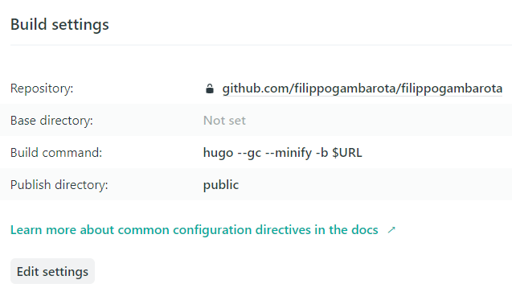

# Making a peRsonal website with Hugo and Github

This repository contains materials about building a personal and academic website using Hugo and the Academic theme. There are [introduction slides](https://filippogambarota.github.io/hugo_tutorial/) and some links and resources to get started with Hugo. This is not a complete guide to Hugo or a deep tutorial about managing a static website but simply a starting point.

# Table of Contents

- [Making a peRsonal website with Hugo and Github](#making-a-personal-website-with-hugo-and-github)
- [Table of Contents](#table-of-contents)
  - [Hugo](#hugo)
  - [Academic Theme](#academic-theme)
  - [Blogdown](#blogdown)
  - [Netlify](#netlify)
- [A tested workflow](#a-tested-workflow)
    - [1. Create a Github repository](#1-create-a-github-repository)
    - [2. RStudio Project](#2-rstudio-project)
    - [3. Clone the Github repository](#3-clone-the-github-repository)
    - [4. Connect Netlify and Github](#4-connect-netlify-and-github)
- [How to manage the website](#how-to-manage-the-website)
  - [Fundamental commands](#fundamental-commands)
- [How to modify the theme](#how-to-modify-the-theme)
- [Other useful resources](#other-useful-resources)
  - [Blog Posts](#blog-posts)

## Hugo

[Hugo website](https://gohugo.io/) has a very complete but sometimes complicate and overwhelming documentation. However, **Hugo** needs to be installed as a normal application. Following the [quick start guide](https://gohugo.io/getting-started/quick-start/) is a good starting point.
Hugo has several [themes](https://themes.gohugo.io/) that both customize the appearance and the structure of the website integrating different templates and features.

For having a great and quick introduction to Hugo, even if you are going to use other software than RStudio, the online [Blogdown](https://bookdown.org/yihui/blogdown/) book is a good resource. Especially in the **Hugo** section, the book offers an overview of main features to understand the Hugo organization.

## Academic Theme

The [Academic Theme](https://sourcethemes.com/academic/) is a beautiful and complete theme for Hugo that is developed for academic needs. The documentation is very complete and clear. After installing Hugo there are different ways to start using this theme inside the [Get Started](https://sourcethemes.com/academic/docs/install/) section. If you want to deeply customize the theme there is a [specific section](https://sourcethemes.com/academic/themes/). It is also possible to build a theme from scratch but goes beyond the scope of this introduction.

## Blogdown

[Blogdown](https://bookdown.org/yihui/blogdown/) is an R Package based on Hugo framework that has two main features:
* Allows the usage of `.RMarkdown and .Rmd` files. In this way is possible to embed R code directly inside the website contents.
* Simplify the Hugo framework with R commands

## Netlify

[Netlify](https://www.netlify.com/) is a hosting service with free plans. You can simply connect your GitHub account, select the website repository and then the `/public` directory inside the main website folder will be tracked and hosted online by the service. When you change something inside the GitHub repository, Netlify detects the changes and upload all changed files.

# A tested workflow

There are several methods to create and manage a Hugo website. However, there are few steps that are common regardless of the method you choose.

* Having a GitHub Repository
* Connect with your Hosting Service
* Change your files locally or directly inside the Github repository(not recommended)

So I propose a workflow for starting with Hugo and Academic especially for understanding the structure and how to manage the website. For this method I use **RStudio** (so the **Blogdown** package), **GitHub** and **Netlify**.

### 1. Create a Github repository

Before creating the website locally, create a GitHub repository and initialize with a `README.md` file.

### 2. RStudio Project

Open RStudio and install the **Blogdown package** `install.packages("blogdown")`. Then restart RStudio and `Create a project > New Directory > Website using blogdown`. Complete all fields as in the image below. The most important part is the `Hugo Theme` section. here is the **GitHub** repository to the Academic (or whatever you want) theme. In this way, Blogdown creates automatically your website applying the Academic theme.

### 3. Clone the Github repository

Then you can clone the Github repository and put all files of the previous point inside the locally cloned repository. In this way, you connect the `RStudio Project` with the GitHub repository. All changes are now tracked and you can use the integrated version control system or using the terminal within RStudio.
When you make some changes, press the `build site` button in the **environment section** for creating the website within the `/public` folder.

### 4. Connect Netlify and Github

Create a profile on Netlify and press `New site from Git`. After selecting the GitHub repository, we have to set up the `Build Settings` as below. The most important part is the `Build Command`. Following the Blogdown tutorial, this command is set as `Hugo`. However, using this command the website will not be uploaded correctly. With the command `hugo --gc --minify -b $URL` everything works fine.
After a few minutes the website is deployed and you can change the name `websitename.netlify.com` and also use a custom domain.

# How to manage the website

There are several methods to manage the website, depending on the typology of contents and complexity of the website structure. Using the Blogdown package you can simply follow the package documentation and book for having a complete overview. Using different tools you can refer to Hugo and the theme documentation.

## Fundamental commands

Hugo has a lot of functions and commands. There are few useful commands such as:

`hugo new  --kind post post/my-article-name`

This creates a new content based on Hugo templates within the selected path. For in this case a new **post like** files named "my-article-name" will be created inside the `post` folder. Inside the **academic theme** you can use different templates like `publication` and `talk`.

`hugo server` and Blogdown equivalent `blogdown::serve_site()`

This will render the website locally so you can see all your changes before pushing it online. Furthermore, you can have a live preview update of all modifications simply saving the files and sometimes refresh the webpage.

# How to modify the theme

The Academic theme has several customization options. You can set a combination of `Fonts` and `Colors` for customizing the standard theme. For example in the [themes](https://sourcethemes.com/academic/themes/) section of the documentation you can find different combinations.
Changing the `theme = ""` parameter inside the `config/_default/params.toml` file, will affect the entire website. You can also deeply customize the appaerance of your standard theme following the [documentation](https://sourcethemes.com/academic/docs/customization/#custom-theme). For example, if you want to customize the colors combination of the standard **minimal theme**, you can go to `themes/hugo-academic/data/themes/minimal.toml` and changing colors using the **html color code**. There are also other possibilities such as changing **fonts** and using **custom icons**.

# Other useful resources

## Blog Posts

[Overwhelmed by Hugo academic theme: a beginner's guide](https://andreaczhang.rbind.io/post/my-1st-blogpost/)

[Why you should create your website with Academic and Hugo](https://georgecushen.com/create-your-website-with-hugo/)

[Tips for using the Hugo academic theme](https://lmyint.github.io/post/hugo-academic-tips/)

[http://www.jenniferbradham.org/post/tips_websitecreation/](http://www.jenniferbradham.org/post/tips_websitecreation/)
