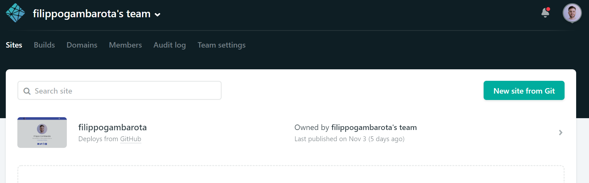

```{r setup, include=FALSE}
options(htmltools.dir.version = FALSE)
knitr::opts_chunk$set(fig.retina=2)
```

class: inverse, center, middle

# What we need for creating our website?

---
# What we need for creating our website?

--

### Hugo Framework

--

### GIT and Github

--

### An hosting service

--

### Optionally:
  
  * A code editor with `version control functions` for example **RStudio** or **VSCode**
  
  * A **custom domain** instead of `website.github.io, website.netlify.com`
  
---
class: inverse, center, middle

# Hugo Framework

```{r echo=FALSE, out.width=500, fig.align='center'}
knitr::include_graphics("img/hugo.svg")
```

---

# Hugo

* ### Hugo is a **static site generator** written in GO that allow to easily create and manage fast and secure website.

</br>

* ### The whole website is **stored locally and deployed** through your favorite service.

</br>

* ### You can write your contents in **Markdown**, **RMarkdown** and **HTML**.

</br>

* ###There are different themes for different needs: portfolio, personal webpage, academic webpage, etc.

---
# Academic Theme

* ### This is a **theme** (more than a simple graphical customization) specifically developed for academic purposes.

* ### There are several templates for different tipical academic contents: posters, talks, publications and cv-like functions (experience, skills, etc.)

```{r echo=FALSE, fig.align='center',out.width= 700}

```

---

# GIT and GitHub

* The website is **created locally** but all changes are tracked with **GIT** and committed to **GitHub** (or other online repositories like Gitlab).

* You can manage your website **simply changing files and pushing to Github**

.pull-left[

```{r echo=FALSE, fig.align='center', out.width= 500}

```

]

.pull-right[

```{r echo=FALSE, fig.align='center'}
knitr::include_graphics("img/websitegithub.png")
```

]

---

# Hosting Service - Netlify

* Netlify is a free hosting and deploying service (up to a certain amount of traffic and functions) perfectly integrated with Hugo, Github and the Academic theme.

* Support a **custom domain**. For example Google offer a domain `.com` for 12$ per year and you can avoid `.github.io` or `netlify.com`.

```{r echo=FALSE, fig.align='center'}

```

---

# Summing up

</br>

```{r echo=FALSE, fig.align='center'}

```

---
class: inverse, center, middle

# How to manage the website?

---

# How to manage the website?

</br>

### 1. Using an **IDE** with version-control features and maybe advanced markdown support
</br>
### 2. Using **RStudio** with `Blogdown`
</br>
### 3. Using a **Content Management System** (CMS)

---

# 1. VSCode (what I mostly use)

* VSCode is an open-source coding environment with version control and advanced markdown support (live preview, Syntax highlighting, etc.)

```{r echo=FALSE, fig.align='center'}

```

---

# 2. Blogdown by Yihui Xie

* Is a package that natively support Hugo framework and Hugo commands. 

* In addition given the support of RMarkdown files you can use your R code inside the website as in a standard RMarkdown HTML report.

```{r echo=FALSE, fig.align='center', out.width=800}

```

---

# 3. CMS

### It's a **point and click** editor like Wordpress or similar services.

### ⚠️ Netlify CMS for example should be natively integrated with Hugo <u> but not with the Academic theme </u>. So the structure of Academic may not be compatible.

.pull-left[

]

.pull-right[

]
---
class: inverse, center, middle

# Let's view how Hugo looks like 😉

### Check [filippogambarota/hugo_tutorial](https://github.com/filippogambarota/hugo_tutorial) on Github for these slides and other resources!

<br/>
<br/>

### .large[[filippo.gambarota@phd.unipd.it](mailto:filippo.gambarota@phd.unipd.it)]

<br/>
<br/>

.tiny[Slides made with the [Xaringan](https://github.com/yihui/xaringan) package by [Yihui Xie](https://yihui.name/)]


```{r echo=FALSE, out.width=450}

```
